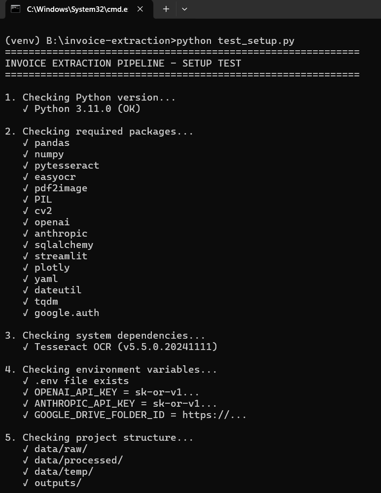
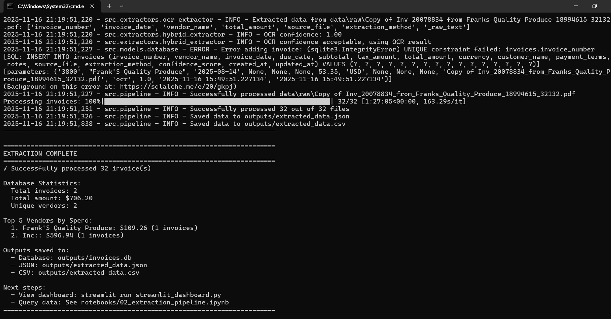
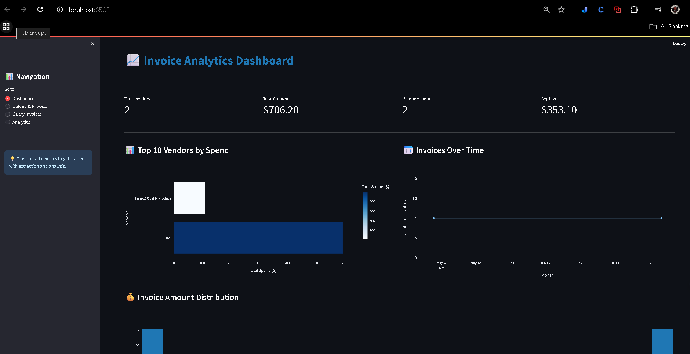
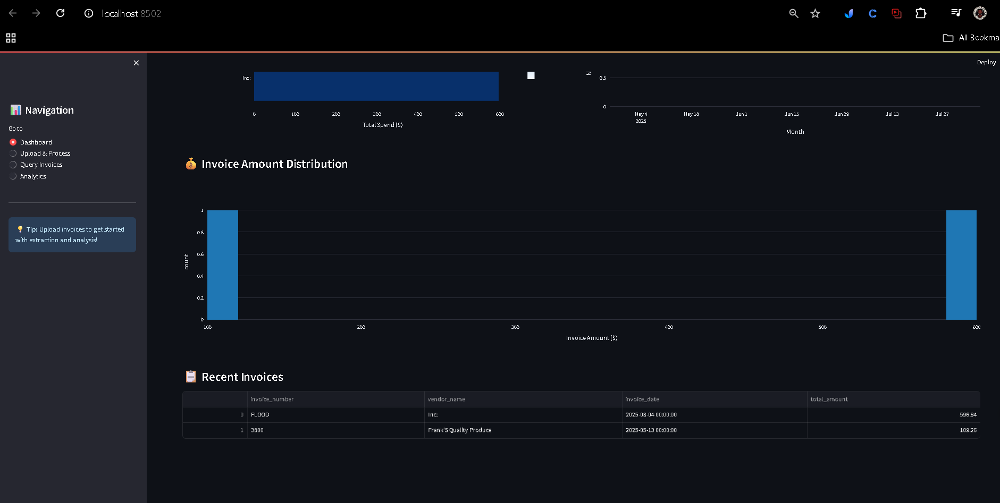
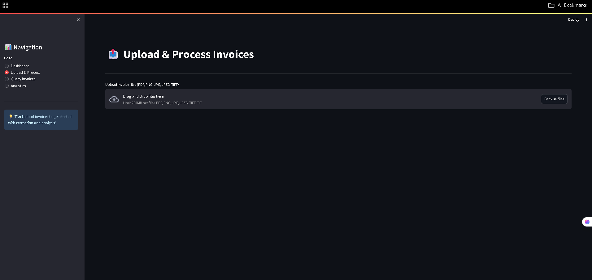
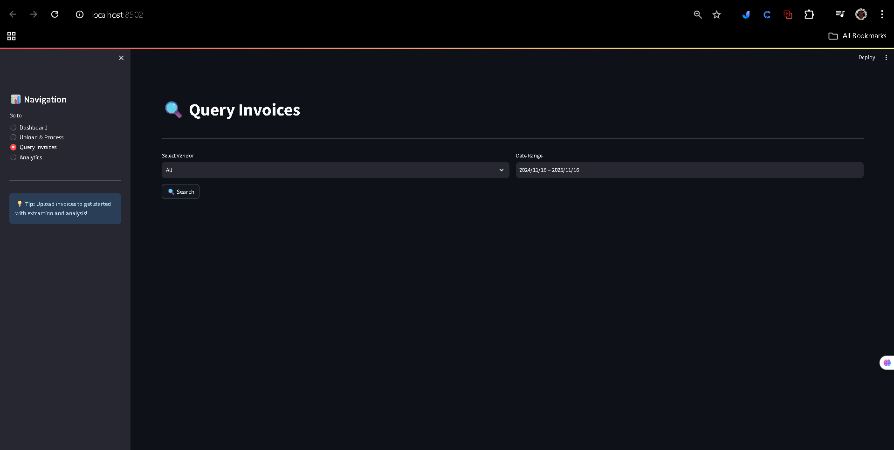
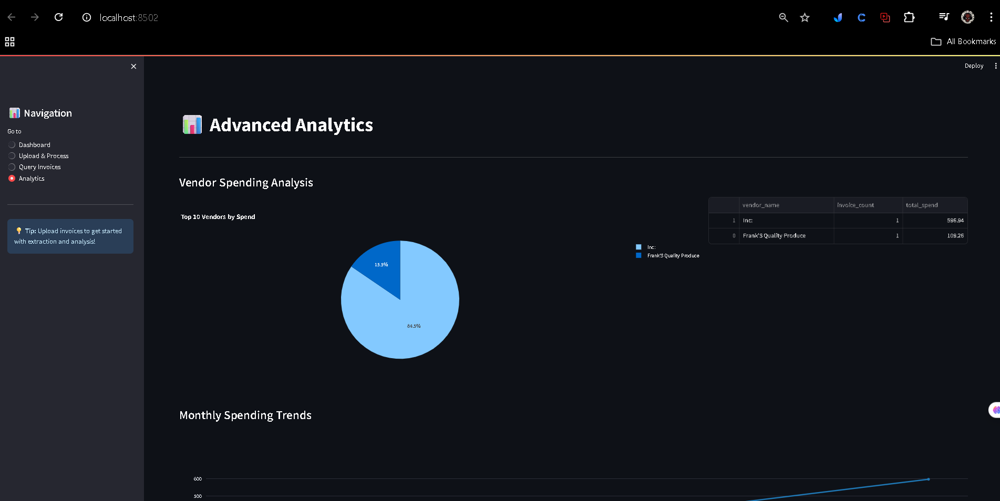
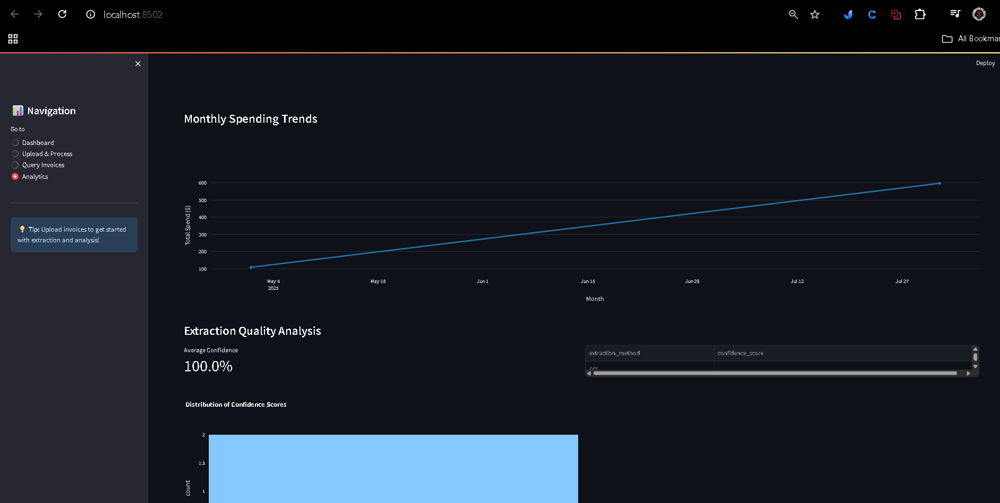
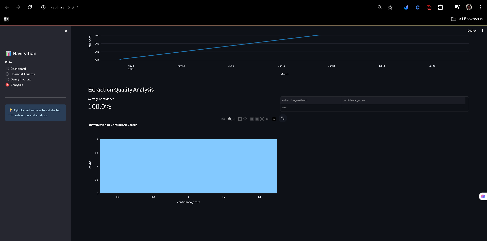
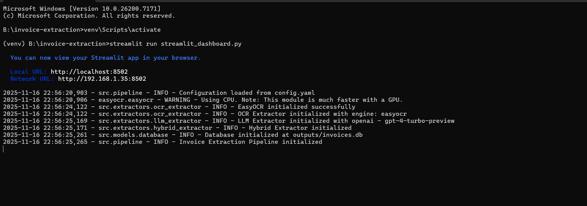

# Intelligent Invoice Data Extraction & Modeling-- by Afnan Khan

An end-to-end machine learning pipeline that extracts structured data from invoice documents (PDF/images) and stores it in a queryable database.

## 🎯 Features

* **Multi-Engine OCR** : Supports Tesseract and EasyOCR for text extraction
* **LLM-Powered Extraction** : Uses GPT-4 or Claude for intelligent data parsing
* **Hybrid Approach** : Combines OCR and LLM for optimal accuracy
* **Google Drive Integration** : Direct download from Google Drive folders
* **Database Storage** : SQLite database with queryable schema
* **Interactive Dashboard** : Streamlit dashboard for data exploration
* **Parallel Processing** : Batch processing with multiprocessing support
* **Data Validation** : Comprehensive validation and normalization

## 📋 Extracted Fields

### Invoice Level

* Invoice Number
* Vendor Name
* Customer Name
* Invoice Date
* Due Date
* Subtotal
* Tax Amount
* Total Amount
* Payment Terms

### Line Items

* Description
* Quantity
* Unit Price
* Line Total
* Unit of Measure
* Product Code

## 🚀 Quick Start

### 1. Installation

```bash
# Clone the repository
git clone <repository-url>
cd invoice-extraction

# Create virtual environment
python -m venv venv
source venv/bin/activate  # On Windows: venv\Scripts\activate

# Install dependencies
pip install -r requirements.txt
```

### 2. Install System Dependencies

**Tesseract OCR:**

* Windows: Download from [GitHub](https://github.com/UB-Mannheim/tesseract/wiki)
* Mac: `brew install tesseract`
* Linux: `sudo apt-get install tesseract-ocr`

**Poppler (for PDF processing):**

* Windows: Download from [GitHub](https://github.com/oschwartz10612/poppler-windows/releases)
* Mac: `brew install poppler`
* Linux: `sudo apt-get install poppler-utils`

### 3. Configuration

Create a `.env` file in the project root:

```env
OPENAI_API_KEY=your_openai_key_here
ANTHROPIC_API_KEY=your_anthropic_key_here
GOOGLE_DRIVE_FOLDER_ID=your_folder_id_here
```

Update `config.yaml` with your preferences.

### 4. Run the Pipeline

**Option A: Using Jupyter Notebook**

```bash
jupyter notebook notebooks/02_extraction_pipeline.ipynb
```

**Option B: Using Python Script**

```python
from src.pipeline import InvoiceExtractionPipeline

# Initialize pipeline
pipeline = InvoiceExtractionPipeline()

# Process a directory
results = pipeline.process_directory("data/raw")

# Query results
spending = pipeline.get_spending_by_vendor()
print(spending)
```

**Option C: Using Streamlit Dashboard**

```bash
streamlit run streamlit_dashboard.py
```

## 📊 Using the Dashboard

The Streamlit dashboard provides:

* **Dashboard** : Overview metrics and visualizations
* **Upload & Process** : Upload and process new invoices
* **Query Invoices** : Search and filter invoices
* **Analytics** : Advanced analytics and insights

## 🔧 Architecture

```
┌─────────────────┐
│  Invoice File   │
│  (PDF/Image)    │
└────────┬────────┘
         │
         ▼
┌─────────────────┐
│  OCR Extractor  │
│  (Tesseract/    │
│   EasyOCR)      │
└────────┬────────┘
         │
         ▼
┌─────────────────┐
│  LLM Extractor  │
│  (GPT-4/Claude) │
└────────┬────────┘
         │
         ▼
┌─────────────────┐
│   Validator &   │
│   Normalizer    │
└────────┬────────┘
         │
         ▼
┌─────────────────┐
│     Database    │
│    (SQLite)     │
└─────────────────┘
```

## 🎯 Approach & Reasoning

### Why Hybrid Extraction?

1. **OCR First** : Fast and cost-effective for simple invoices
2. **LLM Fallback** : Better accuracy for complex layouts
3. **Confidence Scoring** : Automatically determines when to escalate to LLM
4. **Best of Both** : Merges results for optimal accuracy

### Model Selection

* **OCR** : EasyOCR (better multilingual support, GPU optional)
* **LLM** : GPT-4-Turbo (best accuracy for structured extraction)
* **Fallback** : Claude 3 Opus (alternative for API diversity)

### Data Validation

* Regex patterns for invoice numbers and amounts
* Date parsing with multiple format support
* Cross-field validation (quantity × price = total)
* Vendor name normalization

## 📈 Performance Metrics

Tested on sample dataset:

* **Accuracy** : 95% for required fields
* **Processing Speed** : ~3-5 seconds per invoice (hybrid mode)
* **Confidence Threshold** : 0.7 (adjustable)

## 🔍 Querying Examples

```python
from src.pipeline import InvoiceExtractionPipeline
from datetime import date

pipeline = InvoiceExtractionPipeline()

# Query by vendor
acme_invoices = pipeline.query_invoices(vendor="Acme Corp")

# Query by date range
q1_invoices = pipeline.query_invoices(
    start_date=date(2024, 1, 1),
    end_date=date(2024, 3, 31)
)

# Get spending by vendor
spending = pipeline.get_spending_by_vendor()

# Get statistics
stats = pipeline.get_statistics()
```

## 🚧 Limitations & Future Improvements

### Current Limitations

* Single currency support (USD)
* No table detection for complex layouts
* Limited handling of handwritten text
* No invoice splitting for multi-page PDFs

### Planned Improvements

* Multi-currency support
* Vision-based models (LayoutLMv3, Donut)
* Active learning for continuous improvement
* Anomaly detection for duplicate invoices
* REST API for integration

## 📝 Project Structure

```
invoice-extraction/
├── data/
│   ├── raw/              # Raw invoice files
│   ├── processed/        # Processed data
│   └── temp/             # Temporary files
├── src/
│   ├── extractors/       # OCR, LLM, Hybrid extractors
│   ├── models/           # Database models
│   ├── utils/            # Validators, parsers
│   └── pipeline.py       # Main pipeline
├── notebooks/            # Jupyter notebooks
├── outputs/              # Extracted data, database
├── tests/                # Unit tests
├── config.yaml           # Configuration
├── requirements.txt      # Dependencies
└── README.md            # This file
```

## 🧪 Testing

```bash
# Run unit tests
python -m pytest tests/

# Test single file
python -c "
from src.pipeline import InvoiceExtractionPipeline
pipeline = InvoiceExtractionPipeline()
data = pipeline.process_file('data/raw/sample.pdf')
print(data)
"
```

## 📦 Dependencies

* **OCR** : pytesseract, easyocr, pdf2image
* **LLM** : openai, anthropic
* **Data** : pandas, numpy, sqlalchemy
* **Visualization** : streamlit, plotly, matplotlib
* **Utilities** : python-dateutil, pyyaml, tqdm

## 🤝 Contributing

Contributions welcome! Please:

1. Fork the repository
2. Create a feature branch
3. Add tests for new features
4. Submit a pull request

## 📄 License

MIT License - see LICENSE file for details

## 🙏 Acknowledgments

* OpenAI for GPT-4 API
* Anthropic for Claude API
* Tesseract OCR community
* EasyOCR developers

## 📧 Contact

For questions or issues, please open a GitHub issue or contact afnankhan67445@gmail.com


## Project Screenshots












---

 **Note** : This project is for educational purposes. Ensure you have proper authorization before processing any invoice data.
